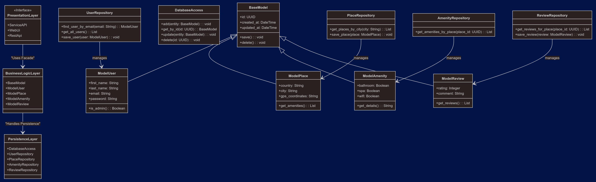

# HBnB Evolution Technical Documentation

## Context and Objective

In this initial phase, the objective is to create comprehensive technical documentation that will serve as the foundation for the development and long-term maintenance of the HBnB Evolution application. This documentation will guide the understanding of the overall architecture, detailed design of the business logic, and system interactions.

## Problem Description

The task involves documenting the architecture and design of a simplified version of an AirBnB-like application, named **HBnB Evolution**. The application will enable users to perform the following key operations:

- **User Management**: Users can register, update their profiles, and be identified as regular users or administrators.
- **Place Management**: Users can list properties they own, specifying details such as name, description, price, and location (latitude and longitude). Each place can also have a list of amenities.
- **Review Management**: Users can leave reviews for places they have visited, including a rating and comment.
- **Amenity Management**: The application manages amenities that can be associated with places.

## Business Rules and Requirements

### User Entity
- Each user has a first name, last name, email, and password.
- Users can be identified as administrators via a boolean attribute.
- Users can register, update their profiles, and be deleted.

### Place Entity
- Each place has a title, description, price, latitude, and longitude.
- Places are associated with the user who created them (owner).
- Places can have a list of amenities.
- Places can be created, updated, deleted, and listed.

### Review Entity
- Each review is linked to a specific place and user, and includes a rating and comment.
- Reviews can be created, updated, deleted, and listed by place.

### Amenity Entity
- Each amenity has a name and description.
- Amenities can be created, updated, deleted, and listed.
- All objects should be uniquely identified by an ID.
- For audit purposes, the creation and update datetime should be stored for all entities.

## Architecture and Layers

The application follows a layered architecture divided into:
- **Presentation Layer**: This includes services and API through which users interact with the system.
- **Business Logic Layer**: This contains the models and core logic of the application.
- **Persistence Layer**: This layer is responsible for storing and retrieving data from the database.

## Persistence

All data will be persisted in a database, which will be specified and implemented in Part 3 of the project.

---

## Tasks Overview

### Task 0: High-Level Package Diagram

This diagram represents the three-layer architecture of the HBnB application, structured as follows:

- **Presentation Layer**: This layer handles user interactions via exposed APIs and services. It serves as the interface between the users (or external systems) and the application's functionalities. Key components include `ServiceAPI`, `WebUI`, and `RESTAPI`, which provide access to the application's features.

- **Business Logic Layer**: This is the core of the application, where business rules and logic are implemented. It includes the primary models, such as `User`, `Place`, `Review`, and `Amenity`, which define the system's entities. This layer ensures that the data manipulation adheres to the application's rules.

- **Persistence Layer**: This layer manages the database connection and handles all data storage and retrieval operations. Components like `UserRepository`, `PlaceRepository`, and `DatabaseAccess` abstract the database operations and allow the Business Logic Layer to interact with the underlying data.

The **Facade Pattern** is key here, simplifying communication between the layers by providing a unified interface that hides the complexities of the Business Logic Layer. This allows the Presentation Layer to interact without needing knowledge of internal processes.

---

## Task 1: Detailed Class Diagram for Business Logic Layer

In this task, we created a detailed class diagram representing the key entities and relationships within the Business Logic layer of the HBnB application. The diagram focuses on the following core entities: **BaseModel**, **User**, **Place**, **Review**, and **Amenity**. Each entity is designed with specific attributes and methods to support the application's functionality.

### Key Entities:
- **BaseModel**: A superclass that provides common attributes for all entities in the system. These include a unique identifier (UUID), as well as timestamps for creation (`created_at`) and updates (`updated_at`). It also defines common methods like `save()` and `delete()` for handling database operations.

- **User**: Represents the individuals using the platform. Each user can create places and write reviews. Attributes include a name, email, and inheritance of the common attributes from **BaseModel**.

- **Place**: Represents properties listed on the platform. A place can have multiple reviews and amenities. Attributes include the name, location, and capacity, along with inherited attributes from **BaseModel**. The entity also contains methods for adding amenities and retrieving reviews.

- **Review**: Represents feedback left by users on specific places. Each review includes a rating and text, as well as timestamps inherited from **BaseModel**. A user can write multiple reviews for different places.

- **Amenity**: Represents the features offered by a place, such as WiFi or a pool. This entity is associated with places through a composition relationship and inherits common attributes from **BaseModel**.

### Relationships:
- **BaseModel**: Serves as the foundation for all entities, providing essential attributes like UUIDs and timestamps.
- **User to Place**: A user can create multiple places (one-to-many association).
- **User to Review**: A user can write multiple reviews (one-to-many association).
- **Place to Review**: A place can have multiple reviews (one-to-many association).
- **Place to Amenity**: A place can have multiple amenities (composition relationship), meaning amenities are tightly coupled to places and do not exist independently.

This diagram is essential for understanding the architecture of the business logic layer and the interactions between these core entities.

---

### Task 2: Sequence Diagrams for API Calls

The sequence diagrams below illustrate the interactions between the user, the API, Business Logic, and the database for different operations:

#### 1. User Registration
1. **User**: Sends a registration request to the API with their information.
2. **API**: Validates fields (email format, password strength, etc.).
3. **API**: Forwards the information to the Business Logic layer for user creation.
4. **BusinessLogic**: Checks if the user already exists.
5. **Database**: Accepts the user creation request if the email is unique.
6. **BusinessLogic**: Creates an authentication token or sends a confirmation email.
7. **API**: Sends a response to the user confirming registration.

#### 2. Place Creation
1. **User**: Sends a place creation request.
2. **API**: Forwards the request to the Business Logic layer for validation.
3. **BusinessLogic**: Validates the place details and sends them to the database.
4. **Database**: Stores the new place.
5. **BusinessLogic**: Confirms the creation to the API.
6. **API**: Returns a response to the user.

#### 3. Review Submission
1. **User**: Sends a review submission request.
2. **API**: Forwards the request to the Business Logic layer.
3. **BusinessLogic**: Validates and stores the review.
4. **Database**: Saves the review.
5. **BusinessLogic**: Confirms the review submission to the API.
6. **API**: Returns a response to the user.

#### 4. Fetching a List of Places
1. **User**: Requests a list of places.
2. **API**: Forwards the request to the Business Logic layer.
3. **BusinessLogic**: Requests the list of places from the database.
4. **Database**: Returns the list of places.
5. **BusinessLogic**: Sends the list to the API.
6. **API**: Returns the list to the user.

---

### Task 3: Documentation Compilation

This task compiles all diagrams, class relationships, and sequence interactions into a final technical document that will serve as a blueprint for developers and stakeholders. Below is the final diagram encapsulating the overall architecture of the HBnB Evolution application.

